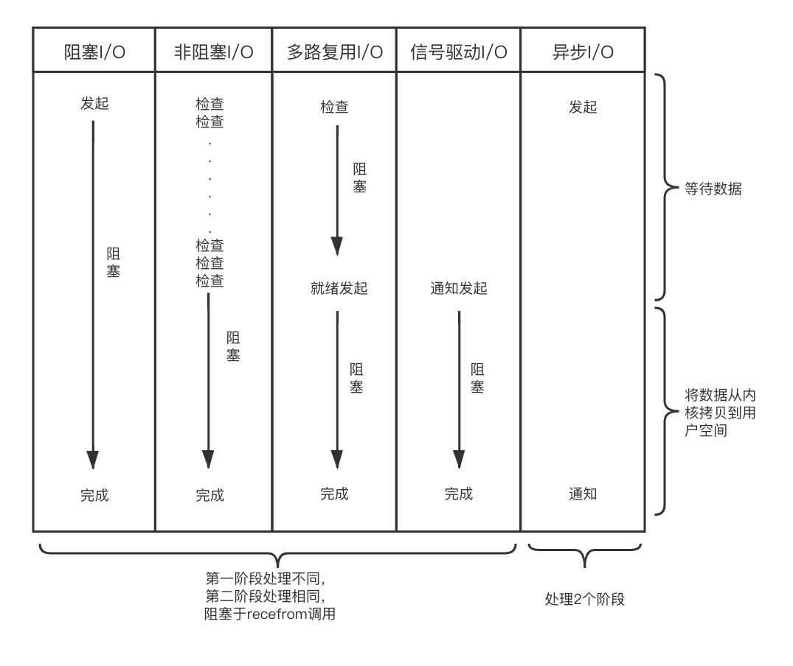
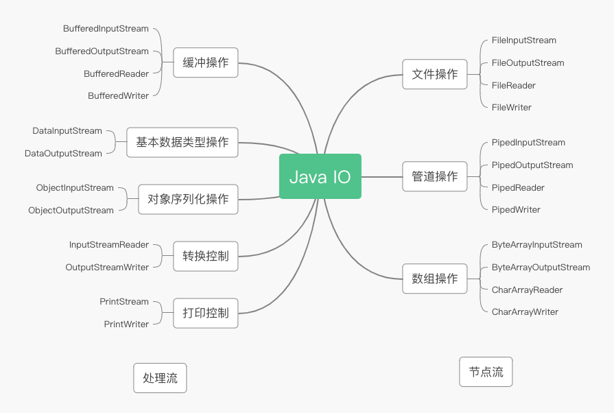
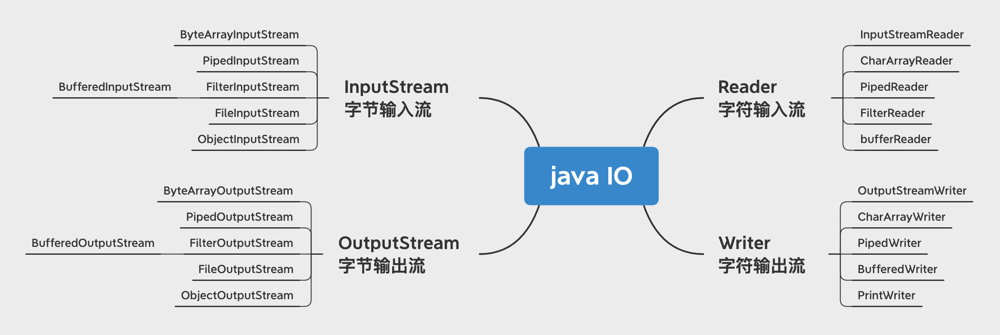
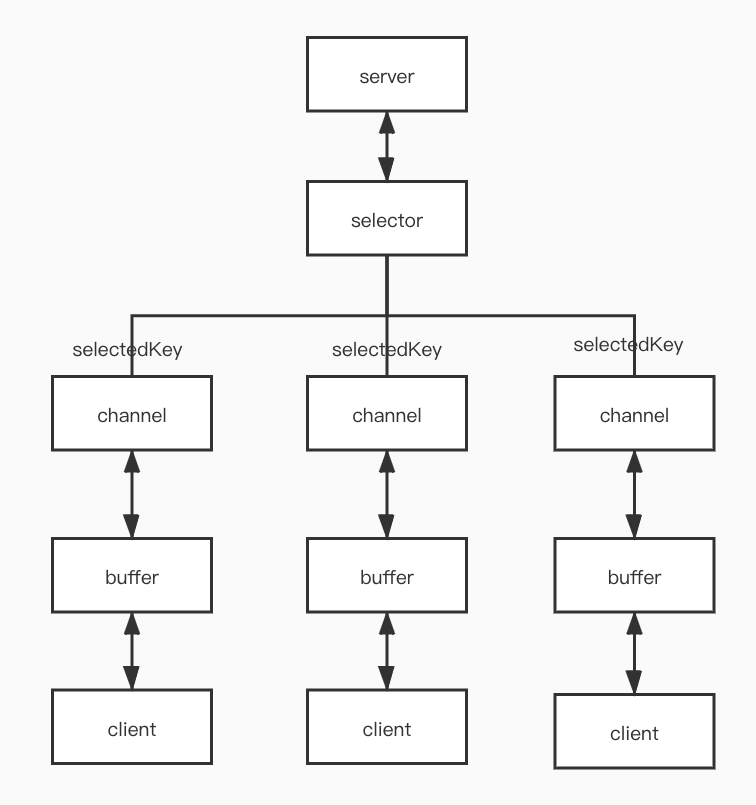

# Java NIO

### 基本概念

#### 同步与异步（消息通信机制)

    同步是指调用者进行调用后，一直等待结果，有结果才返回；（主动等待）
    异步是指调用者进行调用后，直接返回，可能没有结果，当被调用者有结果时再通知调用者；（被动通知）

#### 阻塞与非阻塞 （等待结果时的状态）

    阻塞是指当调用结果返回之前，当前线程会被挂起，直到等到结果时才会继续执行；
    非阻塞是指如果不能立即得到结果，当前线程不会挂起，可以执行其他事情；
    
#### 举例：烧水

    同步阻塞：一直在烧水旁边，等待烧水结束；
    同步非阻塞：一边做饭，一边检查烧水进度；
    异步阻塞：一直在烧水旁边，但是烧水结束会响起声音提醒你；
    异步非阻塞：去做饭，烧水结束会响起声音提醒你；
    
### 几种常见I/O模型

    阻塞I/O(bloking IO)
    非阻塞I/O(nonblocking IO)
    多路复用I/O(IO multiplexing)
    信号驱动I/O(signal driven IO)
    异步I/O(asynchronous IO)

几种常见IO模型：

    所有的系统I/O都分为两个阶段：等待就绪和操作。

    举例来说，当一个read发生时，它会经历两个阶段:
    1、等待数据准备
    2、将数据从内核内存空间拷贝到进程内存
    
    对于阻塞IO，如果没有数据，会一直阻塞，直到收到数据，返回读到的数据。（我要读)
    对于NIO，如果有数据，就把数据读到内存，并且返回给用户；反之则直接返回0，永远不会阻塞。（我可以读了)
    对于异步IO：不但等待就绪是非阻塞的，就连数据到内存的过程也是异步的。（读完了)
    
### Java IO分类

按操作对象分类：

按操作方式分类：

#### NIO与IO区别:

    IO是面向流的，NIO是面向缓冲区的；
    IO流是阻塞的，NIO流是不阻塞的;
    NIO有选择器，而IO没有；
    
### NIO核心组件

NIO核心组件：

#### Buffer(缓冲区)

    高效数据容器。
    本质上是一块内存区，用于数据的读写

#### Channel(通道)

    在缓冲区和位于通道另一侧的服务之间进行数据传输，支持单向、双向传输，支持阻塞、非阻塞

#### Selector(IO复用器/选择器)

    多路复用的重要组成部分，检查一个或多个Channel(通道)是否是可读、写状态，实现单线程管理多Channel(通道)，优于使用多线程或线程池产生的系统资源开销
    
### NIO源码解析

#### Selector主要方法

    1、java.nio.channels.Selector.open()
    public static void main(String[] args) {
           try {
               //选择器
               Selector selector = Selector.open();
               //打开通道
               ServerSocketChannel channel = ServerSocketChannel.open();
               //通道注册到选择器之前，它必须处于非阻塞模式
               channel.configureBlocking(false);
               //注册此通道
               SelectionKey key = channel.register(selector, SelectionKey.OP_READ);
           } catch (IOException e) {
               e.printStackTrace();
           }
       }
       
     注：由DefaultSelectorProvider根据不同操作系统平台生成的不同的SelectorProvider，Linux系统它会生成EPollSelectorProvider实例，而这个实例会生成EPollSelectorImpl作为最终的Selector实现
     
    2、java.nio.channels.Selector.select()
    准备一组已准备好进行 I/O 操作的 channel 。以阻塞线程的方式，直到返回至少一个符合要求的 channel
    
    3、java.nio.channels.Selector.select(long timeout)
    准备一组已准备好进行 I/O 操作的 channel 。以阻塞线程的方式，直到返回至少一个符合要求的 channel 或者给定的超时时间到期
    
    4、java.nio.channels.Selector.selectNow(）
    准备一组已准备好进行 I/O 操作的 channel 。以非阻塞线程的方式，如果没有符合要求的通道，则直接返回 0
    
    5、java.nio.channels.Selector.wakeUp(）
    让处在阻塞状态的select()方法立刻返回 
    
    6、java.nio.channels.Selector.close()
    使得任何一个在选择操作中阻塞的线程都被唤醒（类似wakeup（）），同时使得注册到该Selector的所有Channel被注销，所有的键将被取消，但是Channel本身并不会关闭
    
    7、java.nio.channels.Selector.selectedKeys(）
    Set selectedKeys=selector.selectedKeys(); 
    准备好可进行 I/O 操作的 channel 后，调用此方法获取已就绪的 channel，之后遍历并判断 channel 对应的事件即可
    
#### SelectionKey主要方法

    1、java.nio.channels.SelectionKey.channel()
    从SelectionKey对象访问被监视的通道
    
    2、java.nio.channels.SelectionKey.selector()
    获取selector
    
    3、java.nio.channels.SelectionKey.attach(Object ob)
     将对象附加到SelectionKey
    
    4、java.nio.channels.SelectionKey.attachment()
     从SelectionKey获取附加的对象
    
    5、可以侦听四个不同的事件，每个事件都由SelectionKey类中的常量表示:
    
    //当服务器准备从通道读取数据时
    public static final int OP_READ = 1 << 0;
    
    //当服务器准备写入通道时
    public static final int OP_WRITE = 1 << 2;
    
    //当客户端试图连接到服务器时;SocketChannel 独有，其它类型 channel 不支持
    public static final int OP_CONNECT = 1 << 3;
    
    //服务器接受来自客户机的连接;ServerSocketChannel 独有，其它类型 channel 不支持
    public static final int OP_ACCEPT = 1 << 4;
    
    6、java.nio.channels.SelectionKey.interestOps()
    返回代表需要Selector监控的IO操作的bit mask
    
    7、java.nio.channels.SelectionKey.readyOps()
    返回代表在相应channel上可以进行IO操作的bit mask
    
    8、
    
    java.nio.channels.SelectionKey.isReadable()

    java.nio.channels.SelectionKey.isWritable()
    
    java.nio.channels.SelectionKey.isConnectable()
    
    java.nio.channels.SelectionKey.isAcceptable()
    
#### Channel主要方法

    FileChannel、DatagramChannel、SocketChannel、ServerSocketChannel
    
##### FileChannel主要方法

    1、FileChannel 类型通道实例从输入流中获取，
    如FileInputStream.getChannel() 或 RandomAccessFile.getChannel()
    
    2、java.nio.channels.FileChannel.read(buffer)
    从 FileChannel 类通道中读取数据并存入指定的 buffer 中
    
    3、java.nio.channels.FileChannel.write(buffer)
    从指定的 buffer 中读取数据并向 FileChannel 类通道写入
    
    4、java.nio.channels.FileChannel.position()
    获取当前 position 位置
    
    5、java.nio.channels.FileChannel.position(long newPosition)
    从指定位置开始写入操作
    
    6、java.nio.channels.FileChannel.truncate(long size)
    指定长度并截取文件
    
    7、java.nio.channels.spi.AbstractInterruptibleChannel.close()
    关闭此通道
    
##### DatagramChannel主要方法

    1、java.nio.channels.DatagramChannel.open(）
    打开一个 DatagramChannel 类型通道
    
    2、java.nio.channels.DatagramChannel.socket().bind(SocketAddress addr)
    接收指定端口中的UDP协议数据
    
    3、java.nio.channels.DatagramChannel.receive(buffer)
    将数据写入到指定 buffer 中
    
    4、java.nio.channels.DatagramChannel.send(ByteBuffer src, SocketAddress target)
    将指定的 buffer 内的数据发送给指定的 IP地址+端口号
    
    5、java.nio.channels.spi.AbstractInterruptibleChannel.close()
    关闭此通道
    
##### SocketChannel主要方法

    1、java.nio.channels.SocketChannel.open()
    打开一个 SocketChannel 类型通道
    
    2、java.nio.channels.SocketChannel.connect(SocketAddress remote）
    通过 Socket 方式连接至指定的IP地址+端口号
    
    3、java.nio.channels.SocketChannel.read(buffet)
    从 SocketChannel 类通道中读取数据并存入指定的 buffer 中
    
    4、java.nio.channels.SocketChannel.write(buffer)
    从指定的 buffer 中读取数据并向 SocketChannel 类通道写入
    
    5、java.nio.channels.spi.AbstractSelectableChannel.configureBlocking(boolean block)
    设置阻塞模式，false 为非阻塞
    
    6、java.nio.channels.spi.AbstractInterruptibleChannel.close()
    关闭此通道
    
##### ServerSocketChannel主要方法

    1、java.nio.channels.ServerSocketChannel.open()
    打开一个 ServerSocketChannel 类型通道
    
    2、java.nio.channels.ServerSocketChannel.bind(SocketAddress local
    监听指定端口下的TCP连接
    
    3、ServerSocketChannel.accept(）
    监听新连接。通常用 while(true){} 方式循环监听，获取到新 channel 后根据其事件做对应操作
    
    4、java.nio.channels.spi.AbstractSelectableChannel.configureBlocking(boolean block)
    设置阻塞模式，false 为非阻塞
    
    5、java.nio.channels.spi.AbstractInterruptibleChannel.close()
    关闭此通道
    
#### Buffer主要方法

    Buffer是NIO用于存放特定基元类型数据的容器。缓冲区是特定基元类型的元素的线性有限序列。
    通过容量(capacity)、限制(limit)和位置(position)三个属性控制数据的写入大小和可读大小。
    缓冲区类型：ByteBuffer、CharBuffer、DoubleBuffer、FloatBuffer、IntBuffer、LongBuffer、ShortBuffer

    1、java.nio.Buffer.capacity()
    缓冲区容量
    
    2、java.nio.Buffer.position(）
    移动偏移量指针
    
    3、java.nio.Buffer.limit(）
    移动限制大小指针
    
    4、java.nio.Buffer.mark()
    打标记，记了当前偏移量的位置。可使用reset恢复到标记位置
    
    5、java.nio.Buffer.reset()
    恢复到标记位置
    
    6、java.nio.Buffer.clear()
    初始化指针,清理所有数据，转换为写模式(实际只是偏移指针，数据还在)
    
    7、java.nio.Buffer.flip()
    将 Buffer 由写模式更改为读模式
    
    8、java.nio.Buffer.rewind()
    重置偏移量指针到初始状态，可以重新写入或重新读取
    
    9、java.nio.Buffer.remaining()
    可读或可写容量
    
    10、java.nio.Buffer.hasRemaining()
    是否可读或可写
    
    11、java.nio.Buffer.hasArray()
    是否有数组缓存，若为堆缓冲区，则会有数据缓存，若为直接缓冲区，则没有。
    
    12、java.nio.Buffer.offset(）
     当前数组偏移量，当把当前数组切片时，无需复制内存，直接指向偏移量
     
### 应用实例

#### 服务端
    
    public class NioServerDemo {
    
        private static final Logger log = LoggerFactory.getLogger(NioServerDemo.class);
    
        // 选择器
        private Selector nioServerSelector;
    
        // 数据通道
        private ServerSocketChannel nioServerSocketChannel;
    
        public static void main(String[] args) {
            // 先运行本类代码，再运行客户端代码
            NioServerDemo nioServer = new NioServerDemo();
    
            // 初始化服务器配置
            nioServer.initServerSocketChannel("localhost", 8081);
    
            // 启动监听
            nioServer.startNioServerSelectorListener();
        }
    
        /**
         * 注册 Channel
         *
         * @param hostname 主机地址
         * @param port     端口号
         */
        private void initServerSocketChannel(String hostname, int port) {
            try {
                // 初始化选择器
                nioServerSelector = Selector.open();
    
                // 打开通道
                nioServerSocketChannel = ServerSocketChannel.open();
    
                // 调整模式为非阻塞
                nioServerSocketChannel.configureBlocking(false);
    
                // 设置端口
                nioServerSocketChannel.socket().bind(new InetSocketAddress(hostname, port));
    
                // 注册此通道
                nioServerSocketChannel.register(nioServerSelector, SelectionKey.OP_ACCEPT);
    
                System.out.println("服务端准备就绪");
            } catch (IOException e) {
                log.error("服务端初始化失败");
            }
        }
    
        /**
         * 启动 Selector
         */
        private void startNioServerSelectorListener() {
            while (true) {
                try {
                    // 选中通道
                    nioServerSelector.select();
    
                    // 获取所有 key
                    Iterator<SelectionKey> nioServerSelectorIterator = nioServerSelector.selectedKeys().iterator();
    
                    while (nioServerSelectorIterator.hasNext()) {
    
                        // 获取 key
                        SelectionKey selectionKey = nioServerSelectorIterator.next();
    
                        // 判断当前 channel 是否可接收 socket 连接
                        if (selectionKey.isAcceptable()) {
    
                            SocketChannel socketChannel = nioServerSocketChannel.accept();
                            socketChannel.configureBlocking(false);
                            socketChannel.register(nioServerSelector, SelectionKey.OP_READ);
    
                            // 判断当前通道是否可读取
                        } else if (selectionKey.isReadable()) {
                            callClient(selectionKey);
                        }
    
                        // 删除已处理完成的 key
                        nioServerSelectorIterator.remove();
                    }
    
                } catch (IOException e) {
                    log.error("startNioServerSelectorListener error", e);
                }
            }
        }
    
        /**
         * 自动回复 Client
         */
        private void callClient(SelectionKey selectionKey) {
            try {
                // 获取对应通道
                SocketChannel socketChannel = (SocketChannel) selectionKey.channel();
    
                // 新建缓冲区
                ByteBuffer byteBuffer = ByteBuffer.allocate(1024);
    
                // 读取通道数据并存入缓冲区
                int index = socketChannel.read(byteBuffer);
    
                // 若通道内有数据
                if (index != -1) {
    
                    System.out.println("服务端接收:" + new String(byteBuffer.array()));
                    // 自动回复（此处可添加对应业务逻辑）
                    socketChannel.write(ByteBuffer.wrap("hello client,im waiting for you!".getBytes()));
                    System.out.println("服务端回复:hello client,im waiting for you!");
    
                } else {
                    // 通道内无数据
                    socketChannel.close();
                }
            } catch (IOException e) {
                log.error("callClient error", e);
            }
        }
    }
    
#### 客户端

    public class NioClientDemo {
    
        private static final Logger log = LoggerFactory.getLogger(NioClientDemo.class);
    
        // 定义通道
        private SocketChannel socketChannel;
    
        public static void main(String[] args) {
            // 先运行服务端代码，再运行本类
            NioClientDemo nioClient = new NioClientDemo();
    
            // 初始化连接服务器配置
            nioClient.initClientChannel("localhost", 8081);
    
            // 发送消息
            nioClient.callServer("hello server,what are you doing?");
        }
    
        /**
         * 初始化客户端 NIO Channel
         *
         * @param hostname
         * @param port
         */
        public void initClientChannel(String hostname, int port) {
            try {
                // 初始化 socket
                InetSocketAddress inetSocketAddress = new InetSocketAddress(hostname, port);
    
                // 建立通道
                socketChannel = SocketChannel.open(inetSocketAddress);
                System.out.println("客户端准备就绪");
            } catch (IOException e) {
                log.error("初始化客户端失败", e);
            }
        }
    
        /**
         * 通信 Server
         *
         * @param callStr
         */
        public void callServer(String callStr) {
            // 将字符串转换为 byte 数组，便于稍后传输
            byte[] requestByte = new String(callStr).getBytes();
    
            // 创建一个1024 容量的 ByteBuffer
            ByteBuffer byteBuffer = ByteBuffer.wrap(requestByte);
            System.out.println("客户端发送:" + new String(byteBuffer.array()));
            if (null == socketChannel) {
                System.out.println("请初始化客户端");
                return;
            }
            try {
                // 向通道写入数据
                socketChannel.write(byteBuffer);
    
                // 清空缓冲区（数据并未被删除，但位置、标记、限制被重置）
                byteBuffer.clear();
    
                // 读取被服务器更新的数据
                socketChannel.read(byteBuffer);
                System.out.println("客户端接收:" + new String(byteBuffer.array()));
                // 关闭通道
                socketChannel.close();
    
            } catch (IOException e) {
                log.info("通信出错", e);
            }
        }
    }
